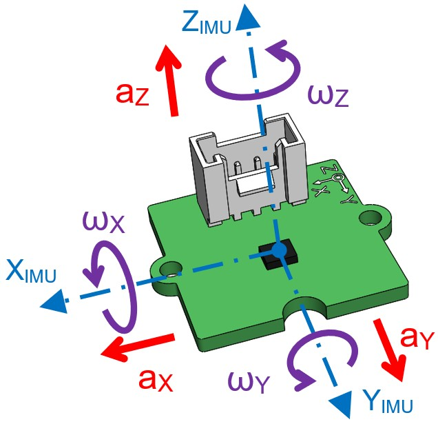

# Formation académique "Au Coeur des centrales Inertielles"

## Objectifs de la formation

✓ Programmer l’acquisition des mesures d'accélérations et de vitesses angulaires avec une centrale inertielle.

✓ Programmer les calculs de l'attitude de la centrale à partir des composantes de l'accéléromètre et du gyromètre et connaitre leurs limites.

✓ Programmer un filtrage simple par fusion des 2 capteurs.

✓ Découvrir les principes de filtrages avancés.

## Matériel utilisé
✓ Un Arduino UNO avec son shield grove : [https://wiki.seeedstudio.com/Base_Shield_V2/](https://wiki.seeedstudio.com/Base_Shield_V2/)

✓ Un module centrale inertielle parmis :
  - Grove_IMU_6 DOF : [wiki.seeedstudio.com/Grove-6-Axis_AccelerometerAndGyroscope](https://wiki.seeedstudio.com/Grove-6-Axis_AccelerometerAndGyroscope/)
  - Grove_IMU_9 DOF : [https://wiki.seeedstudio.com/Grove-IMU_9DOF-lcm20600+AK09918/](https://wiki.seeedstudio.com/Grove-IMU_9DOF-lcm20600+AK09918/)
  - Grove_IMU_9 DOF V2 : [https://wiki.seeedstudio.com/Grove-IMU_9DOF_v2.0/](https://wiki.seeedstudio.com/Grove-IMU_9DOF_v2.0/)
  - Grove_IMU_10 DOF : [https://wiki.seeedstudio.com/Grove-IMU_10DOF_v2.0/](https://wiki.seeedstudio.com/Grove-IMU_10DOF_v2.0/)

## Description

Cette formation s’adresse à des enseignants de pré baccalauréat en spécialité Sciences de l’ingénieur, en STI2D ou éventuellement en spécialité Numérique et Sciences Informatiques.
Les explications et repères historiques sont très succincts et limités à la découverte des concepts.
Les abstractions et les démonstrations mathématiques pour la compréhension des calculs peuvent être relativement complexes pour les élèves de pré-bac.
Pour des questions pédagogiques, elles font donc l’objet de vulgarisations volontaires et les détails des calculs simplifiés ne sont donnés qu’en annexe.
Le lecteur curieux pourra approfondir les différents concepts grâce aux nombreux liens revoyant vers des publications plus poussées qui sont insérés tout au long du document

Pour tout renseignement complémentaire [gael.balduini@gmail.com](mailto:gael.balduini@gmail.com)

